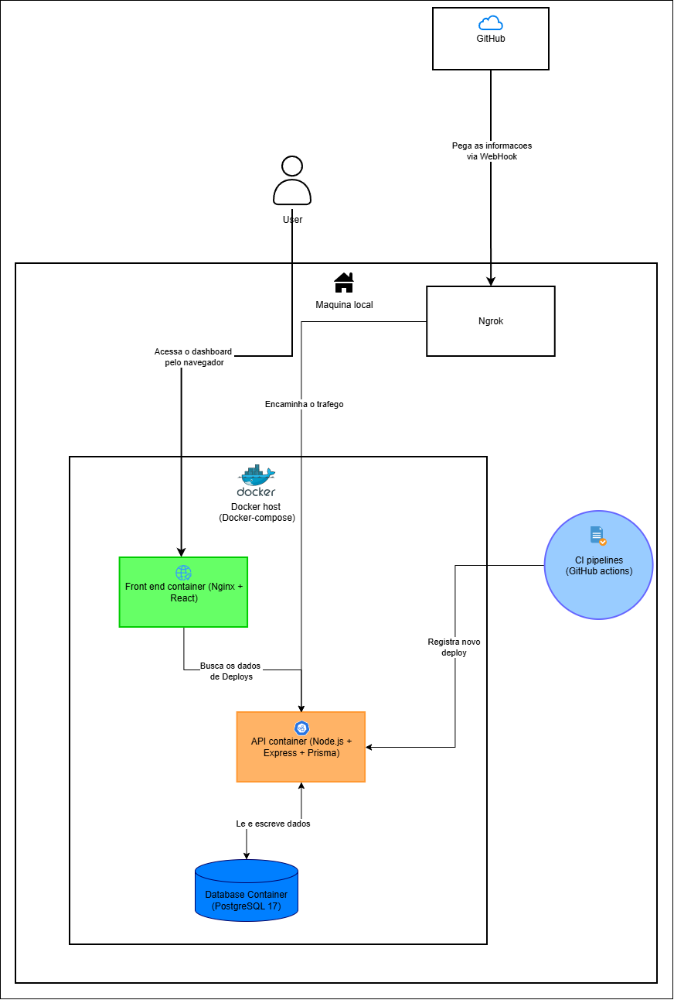

# Deploy Tracker 🚀

Uma plataforma completa (Full-Stack) construída para rastrear, auditar e exibir o histórico de deploys das suas aplicações em tempo real, utilizando webhooks do GitHub.

## 📌 Arquitetura do Sistema

O sistema é totalmente em contêineres e desenhado para conectar o fluxo de CI/CD do GitHub diretamente a um painel de visualização moderno.



*(O diagrama acima ilustra o fluxo de dados: desde o GitHub enviando o Webhook para o Ngrok, que redireciona para a nossa API em Node.js rodando no Docker, até a gravação no banco PostgreSQL e o consumo pelo Front-end em React).*

---

## 🛠 Tecnologias Utilizadas

**Front-end:**
- React + Vite
- TypeScript
- Lucide React (Ícones)
- Vanilla CSS (Tema Premium Dark Mode com Glassmorphism)

**Back-end:**
- Node.js + Express
- TypeScript
- Prisma ORM
- PostgreSQL 17

**Infraestrutura:**
- Docker & Docker Compose (Multi-stage builds)
- Nginx (Servindo o Front-end estático)
- Ngrok (Túnel para Webhooks)

---

## ✨ Funcionalidades

- **Captura Automática (GitHub Webhooks):** Toda vez que um push ou deploy acontece no GitHub, a plataforma registra automaticamente o hash do commit, o autor e a mensagem.
- **Resiliência e UX:** Tratamento visual inteligente para mensagens de commit muito longas (truncamento com botão "Ler mais") e identificação clara de commits sem branch (Detached HEAD).
- **Premium UI:** Interface gráfica construída do zero focada em contraste e conforto visual (Dark Mode Premium).

---

## 🚀 Como Rodar o Projeto

### 1. Subir a Infraestrutura (Docker)
Na raiz do projeto, certifique-se de que o Docker está rodando e execute:
```bash
docker compose up -d --build
```
Isso iniciará três contêineres:
- **Banco de Dados** (Porta 5432)
- **API Back-end** (Porta 3000)
- **Painel Front-end** (Porta 8080)

Você já pode acessar o painel visualizando em `http://localhost:8080`.

### 2. Configurar o Webhook localmente (Ngrok)
Para que o GitHub consiga enviar dados para a sua máquina local, inicie o Ngrok apontando para a porta da API:
```bash
npx ngrok http 3000
```
*Copie a URL pública gerada (ex: `https://seucodigo.ngrok-free.app`).*

### 3. Conectar ao GitHub
1. Vá até o repositório no GitHub > **Settings** > **Webhooks** > **Add webhook**.
2. **Payload URL:** Cole a URL do Ngrok e adicione a rota: `https://seucodigo.ngrok-free.app/webhooks/github`
3. **Content type:** `application/json`
4. Selecione **Just the push event** e salve.

Pronto! Faça um push no seu repositório e veja a mágica acontecer em tempo real no seu painel.